# Cascade - Multi-Repo Change Propagator

**Cline CLI as Infrastructure** | DevWeek Hackathon 2026

> One API change. Multiple repos. Zero manual hunting.

Cascade takes a single change description and propagates it across all connected repositories using the real [Cline CLI](https://docs.cline.bot/cline-cli/overview) as parallel worker agents. Each repo gets its own branch with adapted code, passing tests, and a self-reviewed diff.

## The Problem

In cross-platform applications, a single API change (rename a field, add a parameter, change a response shape) ripples across every consumer -- web frontend, SDK, CLI tool, docs. Engineers manually hunt down every reference in every repo, adapt each one for its language and framework, and hope they didn't miss anything. This takes hours and is error-prone.

## The Solution

```
"The /users endpoint now returns full_name instead of first_name and last_name"
     |
     v
  Cascade
     |
     +---> [cline -y] Backend API      --> branch + adapted code
     +---> [cline -y] Web Dashboard    --> branch + adapted code
     +---> [cline -y] Python SDK       --> branch + adapted code
     +---> [cline -y] CLI Client       --> branch + adapted code
```

Each repo is handled by an independent Cline agent that:
1. **Adapts** the code using `cline -y -c <repo>` (headless, auto-approve)
2. **Tests** using the repo's configured test command
3. **Fixes** failures by piping test output back to `cline -y`
4. **Self-reviews** using `git diff | cline --json`
5. **Commits** to an isolated branch
6. **Creates PRs** on GitHub using the `gh` CLI (for GitHub repos)

## Cline CLI Integration

Cascade uses Cline as a **programmable component** -- not a coding assistant, but infrastructure. Every interaction uses documented flags from the [Cline CLI Reference](https://docs.cline.bot/cline-cli/cli-reference):

| Step     | Command                                                          | Purpose                         |
| -------- | ---------------------------------------------------------------- | ------------------------------- |
| Discover | `cline --json -c <repo> "List files affected by: <change>"`     | Find impacted files per repo    |
| Adapt    | `cline -y -c <repo> --timeout 600 "Apply this change: <change>"`| Implement adaptation headlessly |
| Verify   | `git diff \| cline --json "Review these changes"`               | Self-review the diff            |
| Fix      | `<test output> \| cline -y -c <repo> "Fix these failures"`      | Auto-fix if tests break         |

### Authentication

Cascade authenticates with Cline using an API key from [app.cline.bot/dashboard/account](https://app.cline.bot/dashboard/account?tab=api-keys):

```bash
# 1. Get your API key from https://app.cline.bot/dashboard/account?tab=api-keys
# 2. Add it to .env
echo "CLINE_API_KEY=sk_your_key_here" > .env

# Docker auto-authenticates on container startup using:
cline auth --provider cline --apikey $CLINE_API_KEY --modelid "anthropic/claude-3.5-sonnet"
```

## Architecture

### System Overview


### Propagation Pipeline (per repo)

```mermaid
flowchart LR
    A["🔀 Branch<br/><code>git checkout -b cascade/repo</code>"] --> B["🤖 Adapt<br/><code>cline -y -c repo 'change'</code>"]
    B --> C{"🧪 Test<br/><code>test_cmd</code>"}
    C -->|Pass| E["🔍 Review<br/><code>git diff ∣ cline --json</code>"]
    C -->|Fail| D["🔧 Fix<br/><code>output ∣ cline -y 'fix'</code>"]
    D -->|Retry| C
    E --> F["💾 Commit<br/><code>git commit</code>"]
    F --> G{"GitHub?"}
    G -->|Yes| H["📤 Push & PR<br/><code>git push + gh pr create</code>"]
    G -->|No| I["✅ Done"]
    H --> I

    style A fill:#dbeafe,stroke:#3b82f6
    style B fill:#fef3c7,stroke:#f59e0b
    style C fill:#d1fae5,stroke:#10b981
    style D fill:#fee2e2,stroke:#ef4444
    style E fill:#f3e8ff,stroke:#8b5cf6
    style F fill:#e0e7ff,stroke:#6366f1
    style G fill:#f5f5f5,stroke:#6b7280
    style H fill:#fce7f3,stroke:#ec4899
    style I fill:#d1fae5,stroke:#10b981
```



### Dashboard UI Flow

```mermaid
flowchart LR
    subgraph Tabs["Dashboard Tabs"]
        T1["ℹ️ About<br/><i>Default tab</i>"]
        T2["🔄 Cascade"]
        T3["📊 Analytics"]
    end

    subgraph CascadeTab["Cascade Sub-nav"]
        DM["Demo Mode<br/><i>Local repos</i>"]
        GHM["GitHub Repos<br/><i>Import from GitHub</i>"]
    end

    T2 --> CascadeTab

    DM --> DET2["Detect Drift"]
    DM --> SIM["Simulate Change"]
    DM --> PROP2["Propagate"]

    GHM --> IMP["Import & Scan"]
    GHM --> GHDET["Detect Drift"]
    GHM --> GHPROP["Propagate"]
    GHM --> PRS["Create PRs"]

    style Tabs fill:#e0e7ff,stroke:#6366f1
    style CascadeTab fill:#dbeafe,stroke:#3b82f6
    style T1 fill:#d1fae5,stroke:#10b981
    style T2 fill:#fef3c7,stroke:#f59e0b
    style T3 fill:#f3e8ff,stroke:#8b5cf6
```



### Project Structure

```
cascade/
  __init__.py, __main__.py
  cli.py                  # Typer CLI: run, status, dashboard, init
  core/
    cline.py              # Real Cline CLI subprocess wrapper
    config.py             # cascade.yaml loader
    detector.py           # Schema drift detection (regex-based)
    discovery.py          # Discover affected files per repo
    propagator.py         # Parallel dispatch + pipeline orchestration
    git_ops.py            # Branch, commit, diff operations
    github_ops.py         # Clone, push, PR creation via gh CLI
    reporter.py           # Summary generation
  prompts/
    discover.md           # Discovery prompt template
    adapt.md              # Adaptation prompt template
    verify.md             # Self-review prompt template
    fix_tests.md          # Test-fix prompt template
  dashboard/
    app.py                # FastAPI + WebSocket server
    templates/
      index.html          # Live monitoring dashboard
demo/
  cascade.yaml            # Config pointing to demo repos
  run-demo.sh             # One-command demo script
  repos/
    backend-api/          # Python FastAPI backend (source)
    web-dashboard/        # HTML/JS frontend (consumer)
    python-sdk/           # Python SDK (consumer)
    cli-client/           # Python CLI tool (consumer)
```

## Quick Start

### Prerequisites

- **Node.js 18+** (for Cline CLI)
- **Python 3.11+**
- **Git**
- **Cline API key** from [app.cline.bot](https://app.cline.bot/dashboard/account?tab=api-keys)

### Setup

```bash
# 1. Install Cline CLI
npm install -g cline

# 2. Authenticate Cline
cline auth --provider cline --apikey YOUR_CLINE_API_KEY --modelid "anthropic/claude-3.5-sonnet"

# 3. Install Python dependencies
cd cline/
pip install -r requirements.txt

# 4. Run the demo
bash demo/run-demo.sh
```

### CLI Commands

```bash
# Propagate a change across all repos
python -m cascade run "The /users endpoint returns full_name instead of first_name and last_name"

# Use a specific config file
python -m cascade run --config ./demo/cascade.yaml "change description"

# Dry-run (discovery only, no changes)
python -m cascade run --dry-run "change description"

# Launch live dashboard
python -m cascade dashboard

# Show last run results
python -m cascade status

# Initialize a new cascade.yaml
python -m cascade init
```

### Docker

```bash
# 1. Add your Cline API key to .env
echo "CLINE_API_KEY=sk_your_key_here" > .env

# 2. Launch the dashboard (auto-authenticates Cline on startup)
docker compose up cascade

# 3. Open http://localhost:8450
```

The Docker container automatically:
- Installs the Cline CLI (`npm install -g cline`)
- Authenticates with your `CLINE_API_KEY` on first startup
- Persists Cline auth across restarts via a named volume

```bash
# Run a propagation via CLI
docker compose run --rm cascade-run

# Or with a custom change
docker compose run --rm cascade-run run --config /app/demo/cascade.yaml "your change description"
```

## Live Dashboard

Launch with `python -m cascade dashboard` or `docker compose up cascade` to get a real-time web UI at `http://localhost:8450`.

### Tabs

| Tab | Description |
|-----|-------------|
| **About** (default) | Project overview, features, workflow diagram, tech stack, and references |
| **Cascade** | Combined tab with Demo Mode and GitHub Repos sub-navigation |
| **Analytics** | Session metrics, activity timeline, event breakdown, and repo performance |

### Cascade Tab

The Cascade tab has two modes accessible via a sub-navigation toggle:

- **Demo Mode** -- Simulate schema changes on local demo repos with one click, run drift detection, and trigger propagation
- **GitHub Repos** -- Import repos from GitHub URLs, detect drift across them, propagate changes using Cline CLI, and create PRs

### Features

- Animated cascade logo with gradient glow
- Light/dark theme toggle with auto-persist
- Auto-detect frequency (manual, 10s, 30s, 1min, 5min)
- WebSocket-powered real-time event streaming
- Per-repo progress cards with status, branch, files changed, test results
- Event log with timestamped pipeline events
- Session analytics with metric cards, activity timeline, and event breakdown

## GitHub Integration

Cascade can clone repositories directly from GitHub, detect schema drift, propagate changes using Cline CLI, and create pull requests automatically.

### Setup

```bash
# Authenticate GitHub CLI (required for PR creation)
gh auth login
```

The Docker container mounts your local `~/.config/gh` directory for GitHub CLI authentication.

### Usage (Dashboard)

1. Go to the **Cascade** tab and select **GitHub Repos**
2. Paste GitHub repository URLs (one per line, e.g. `owner/repo` or full URL)
3. Select the **source** (origin) repo
4. Click **Import & Scan** -- repos are cloned, language auto-detected, and drift analysis runs
5. If drift is detected, click **Propagate Changes** -- Cline agents adapt each consumer repo
6. Click **Create All PRs** -- branches are pushed and PRs are created on GitHub

### API Endpoints

| Method | Endpoint | Description |
|--------|----------|-------------|
| `GET`  | `/api/detect` | Scan demo repos for schema drift |
| `POST` | `/api/simulate` | Apply demo schema change to source repo |
| `POST` | `/api/reset` | Reset demo repos to initial state |
| `POST` | `/api/run` | Trigger propagation on demo repos |
| `GET`  | `/api/status` | Current run status |
| `POST` | `/api/github/import` | Clone repos from GitHub URLs |
| `POST` | `/api/github/detect` | Run drift detection on imported repos |
| `POST` | `/api/github/run` | Trigger propagation on GitHub repos |
| `POST` | `/api/github/prs` | Push branches and create PRs |
| `GET`  | `/api/github/status` | Current GitHub integration state |
| `POST` | `/api/github/update-role` | Change a repo's role (source/consumer) |

## Demo Walkthrough

The included demo simulates a cross-platform application with 4 repos:

| Repo | Language | Role | Description |
|------|----------|------|-------------|
| `backend-api` | Python | Source | FastAPI backend with `/users`, `/posts` endpoints |
| `web-dashboard` | JavaScript | Consumer | HTML/JS frontend displaying user names |
| `python-sdk` | Python | Consumer | SDK wrapping the API with dataclasses |
| `cli-client` | Python | Consumer | CLI tool formatting user output |

All repos use `first_name` and `last_name` fields. The demo change is:

> **"The /users endpoint now returns `full_name` instead of separate `first_name` and `last_name` fields."**

Running `bash demo/run-demo.sh` will:

1. Initialize each demo repo as a git repository
2. Run baseline tests (all pass)
3. Launch Cascade to propagate the change across all 4 repos in parallel
4. Show a Rich live table with real-time status per repo
5. Print a summary of branches created, files changed, and test results

## Configuration

The `cascade.yaml` file defines your repos and settings:

```yaml
name: my-project

repos:
  - name: backend
    path: ./backend
    role: source
    language: python
    test_cmd: "python -m pytest -v"

  - name: frontend
    path: ./frontend
    role: consumer
    language: javascript
    test_cmd: "npm test"

settings:
  max_parallel: 4          # Max concurrent Cline agents
  timeout_per_repo: 600    # Seconds per repo
  auto_branch: true        # Create branches automatically
  branch_prefix: "cascade/"
  retry_on_test_fail: true # Retry with test output on failure
  max_retries: 2
```

## License

MIT
